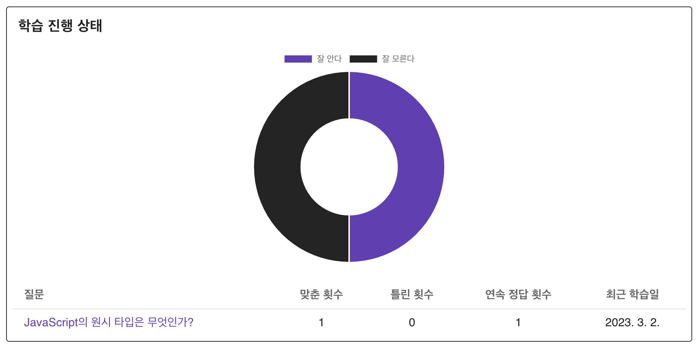

<div align="center">
  <a href="https://github.com/padosum/flashcards">
    
  </a>
  <h3 align="center">FlashCards</h3>
</div>

## 사이트 URL

https://flash.padosum.dev/

## 목적

- markdown 파일을 읽어서 플래시 카드를 만들고 학습하는 애플리케이션입니다.
- 외울 필요가 있는 것들을 잘 기억해내기 위해 만들었습니다.
  - ex) 프로그래밍 언어 문법과 개념 (도서 [프로그래머의 뇌](http://www.yes24.com/Product/Goods/105911017) 참고)
- 장기적 기억을 위해 학습 데이터를 기록, 간격을 두고 반복하기 위해 사용합니다.

### screenshots




<br clear="left"/>

## 프로젝트 관리

- 사용 흐름 기반으로 이슈 생성
- 테스트 주도 개발

## 사용 기술

- front-end: [TypeScript](https://www.typescriptlang.org/), [Vue.js](https://vuejs.org/), [Vuetify](https://vuetifyjs.com/en/)
- testing: [Vitest](https://vitest.dev/), [testing-library](https://testing-library.com/)
- deployment: [Vercel](https://vercel.com/)
- etc: [Vite](https://vitejs.dev/), [Chartjs](https://www.chartjs.org/), [supermemo](https://github.com/Maxvien/supermemo), [markdown-it](https://github.com/markdown-it/markdown-it), [highlight.js](https://highlightjs.org/)

## 설치 및 실행

```bash
  git clone https://github.com/padosum/flashcards.git
  cd flashcards
  npm install
  npm run dev
```

배포:

```bash
  npm run build
```

## Acknowledgments

- Inspired by [flashmd](https://github.com/Steve2955/flashmd)
- [supermemo](https://github.com/Maxvien/supermemo)
- [Icon by Raycast](https://icon.ray.so/)
- [Flash cards icons created by manshagraphics - Flaticon](https://www.flaticon.com/free-icons/flash-cards)
